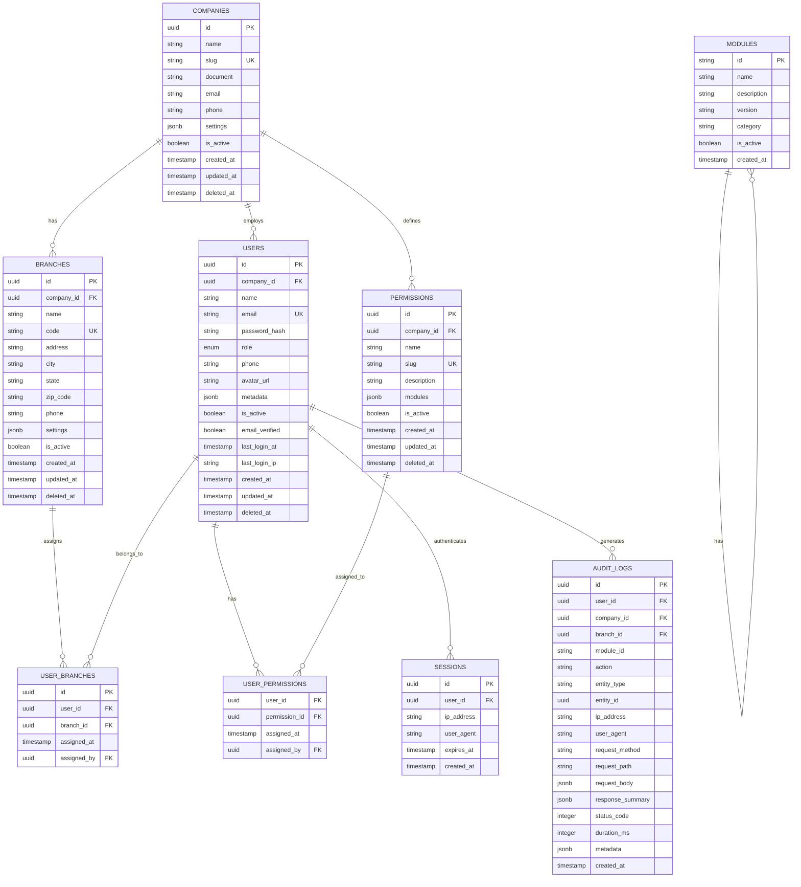

# 02 — Banco de Dados & Migrations

> **Tecnologia**: PostgreSQL 16 + Drizzle ORM

---

## 2.1. Visão Geral

O banco de dados PostgreSQL é a camada de persistência principal. Utilizamos:
- **Drizzle ORM** para queries type-safe e migrations
- **JSONB** para dados flexíveis (metadata de módulos, configurações de permissões, dados de audit)
- **Row-Level Security (RLS)** patterns via middleware (tenant isolation)
- **Soft deletes** em todas as entidades principais (`deleted_at` timestamp)
- **UUIDs v7** como primary keys (ordenados por tempo)

---

## 2.2. Diagrama Entidade-Relacionamento



---

## 2.3. Schemas Drizzle Detalhados

### `companies.ts`

```typescript
import { pgTable, uuid, varchar, text, boolean, timestamp, jsonb, index } from 'drizzle-orm/pg-core';
import { createId } from '../utils/id';

export const companies = pgTable('companies', {
  id: uuid('id').primaryKey().$defaultFn(createId),
  name: varchar('name', { length: 255 }).notNull(),
  slug: varchar('slug', { length: 100 }).notNull().unique(),
  email: varchar('email', { length: 255 }),
  phone: varchar('phone', { length: 20 }),
  settings: jsonb('settings').$type<CompanySettings>().default({}),
  isActive: boolean('is_active').notNull().default(true),
  createdAt: timestamp('created_at', { withTimezone: true }).notNull().defaultNow(),
  updatedAt: timestamp('updated_at', { withTimezone: true }).notNull().defaultNow(),
  deletedAt: timestamp('deleted_at', { withTimezone: true }),
}, (table) => [
  index('companies_slug_idx').on(table.slug),
  index('companies_is_active_idx').on(table.isActive),
]);

// JSONB type para settings
interface CompanySettings {
  timezone?: string;
  locale?: string;
  maxUsers?: number;
  maxBranches?: number;
  theme?: {
    primaryColor?: string;
    logoUrl?: string;
  };
}
```

### `users.ts`

```typescript
import { pgTable, uuid, varchar, text, boolean, timestamp, jsonb, pgEnum, index } from 'drizzle-orm/pg-core';
import { companies } from './companies';

export const userRoleEnum = pgEnum('user_role', [
  'SUPER_ADMIN',
  'SUPPORT', 
  'COMPANY_ADMIN',
  'USER'
]);

export const users = pgTable('users', {
  id: uuid('id').primaryKey().$defaultFn(createId),
  companyId: uuid('company_id').references(() => companies.id),  // null for SUPER_ADMIN/SUPPORT
  name: varchar('name', { length: 255 }).notNull(),
  email: varchar('email', { length: 255 }).notNull().unique(),
  passwordHash: varchar('password_hash', { length: 255 }).notNull(),
  role: userRoleEnum('role').notNull().default('USER'),
  phone: varchar('phone', { length: 20 }),
  avatarUrl: text('avatar_url'),
  metadata: jsonb('metadata').$type<UserMetadata>().default({}),
  isActive: boolean('is_active').notNull().default(true),
  emailVerified: boolean('email_verified').notNull().default(false),
  lastLoginAt: timestamp('last_login_at', { withTimezone: true }),
  lastLoginIp: varchar('last_login_ip', { length: 45 }),
  createdAt: timestamp('created_at', { withTimezone: true }).notNull().defaultNow(),
  updatedAt: timestamp('updated_at', { withTimezone: true }).notNull().defaultNow(),
  deletedAt: timestamp('deleted_at', { withTimezone: true }),
}, (table) => [
  index('users_email_idx').on(table.email),
  index('users_company_id_idx').on(table.companyId),
  index('users_role_idx').on(table.role),
  index('users_is_active_idx').on(table.isActive),
]);

interface UserMetadata {
  preferences?: {
    theme?: 'light' | 'dark' | 'system';
    language?: string;
    notifications?: boolean;
  };
}
```

### `branches.ts`

```typescript
export const branches = pgTable('branches', {
  id: uuid('id').primaryKey().$defaultFn(createId),
  companyId: uuid('company_id').notNull().references(() => companies.id),
  name: varchar('name', { length: 255 }).notNull(),
  state: varchar('state', { length: 2 }),
  settings: jsonb('settings').$type<BranchSettings>().default({}),
  isActive: boolean('is_active').notNull().default(true),
  createdAt: timestamp('created_at', { withTimezone: true }).notNull().defaultNow(),
  updatedAt: timestamp('updated_at', { withTimezone: true }).notNull().defaultNow(),
  deletedAt: timestamp('deleted_at', { withTimezone: true }),
}, (table) => [
  index('branches_company_id_idx').on(table.companyId),
  index('branches_code_idx').on(table.code),
  uniqueIndex('branches_company_code_unique').on(table.companyId, table.code),
]);
```

### `sessions.ts`

```typescript
export const sessions = pgTable('sessions', {
  id: uuid('id').primaryKey().$defaultFn(createId),
  userId: uuid('user_id').notNull().references(() => users.id, { onDelete: 'cascade' }),
  ipAddress: varchar('ip_address', { length: 45 }).notNull(),
  userAgent: text('user_agent'),
  expiresAt: timestamp('expires_at', { withTimezone: true }).notNull(),
  createdAt: timestamp('created_at', { withTimezone: true }).notNull().defaultNow(),
}, (table) => [
  index('sessions_user_id_idx').on(table.userId),
  index('sessions_expires_at_idx').on(table.expiresAt),
]);
```

### `permissions.ts`

```typescript
export const permissions = pgTable('permissions', {
  id: uuid('id').primaryKey().$defaultFn(createId),
  companyId: uuid('company_id').notNull().references(() => companies.id),
  name: varchar('name', { length: 255 }).notNull(),
  slug: varchar('slug', { length: 100 }).notNull(),
  description: text('description'),
  modules: jsonb('modules').$type<string[]>().notNull().default([]),
  isActive: boolean('is_active').notNull().default(true),
  createdAt: timestamp('created_at', { withTimezone: true }).notNull().defaultNow(),
  updatedAt: timestamp('updated_at', { withTimezone: true }).notNull().defaultNow(),
  deletedAt: timestamp('deleted_at', { withTimezone: true }),
}, (table) => [
  index('permissions_company_id_idx').on(table.companyId),
  uniqueIndex('permissions_company_slug_unique').on(table.companyId, table.slug),
]);

// Tabela pivot: quais permissões um usuário tem
export const userPermissions = pgTable('user_permissions', {
  userId: uuid('user_id').notNull().references(() => users.id, { onDelete: 'cascade' }),
  permissionId: uuid('permission_id').notNull().references(() => permissions.id, { onDelete: 'cascade' }),
  assignedAt: timestamp('assigned_at', { withTimezone: true }).notNull().defaultNow(),
  assignedBy: uuid('assigned_by').references(() => users.id),
}, (table) => [
  uniqueIndex('user_permissions_unique').on(table.userId, table.permissionId),
]);

// Tabela pivot: quais filiais um usuário pertence
export const userBranches = pgTable('user_branches', {
  id: uuid('id').primaryKey().$defaultFn(createId),
  userId: uuid('user_id').notNull().references(() => users.id, { onDelete: 'cascade' }),
  branchId: uuid('branch_id').notNull().references(() => branches.id, { onDelete: 'cascade' }),
  assignedAt: timestamp('assigned_at', { withTimezone: true }).notNull().defaultNow(),
  assignedBy: uuid('assigned_by').references(() => users.id),
}, (table) => [
  uniqueIndex('user_branches_unique').on(table.userId, table.branchId),
]);
```

### `modules.ts`

```typescript
export const modules = pgTable('modules', {
  id: varchar('id', { length: 100 }).primaryKey(),
  name: varchar('name', { length: 255 }).notNull(),
  description: text('description'),
  createdAt: timestamp('created_at', { withTimezone: true }).notNull().defaultNow(),
});
```

### `audit-logs.ts`

```typescript
export const auditLogs = pgTable('audit_logs', {
  id: uuid('id').primaryKey().$defaultFn(createId),
  userId: uuid('user_id').references(() => users.id),
  companyId: uuid('company_id').references(() => companies.id),
  branchId: uuid('branch_id').references(() => branches.id),
  moduleId: varchar('module_id', { length: 100 }),
  action: varchar('action', { length: 50 }).notNull(),
  // actions: 'CREATE', 'UPDATE', 'DELETE', 'LOGIN', 'LOGOUT', 'EXPORT', 'TOGGLE', etc.
  entityType: varchar('entity_type', { length: 100 }),
  entityId: uuid('entity_id'),
  ipAddress: varchar('ip_address', { length: 45 }).notNull(),
  userAgent: text('user_agent'),
  requestMethod: varchar('request_method', { length: 10 }),
  requestPath: varchar('request_path', { length: 500 }),
  requestBody: jsonb('request_body'),  // Sanitized (sem senhas)
  responseSummary: jsonb('response_summary'),
  statusCode: integer('status_code'),
  durationMs: integer('duration_ms'),
  metadata: jsonb('metadata').$type<Record<string, unknown>>().default({}),
  createdAt: timestamp('created_at', { withTimezone: true }).notNull().defaultNow(),
}, (table) => [
  index('audit_logs_user_id_idx').on(table.userId),
  index('audit_logs_company_id_idx').on(table.companyId),
  index('audit_logs_action_idx').on(table.action),
  index('audit_logs_entity_idx').on(table.entityType, table.entityId),
  index('audit_logs_created_at_idx').on(table.createdAt),
  // Index para busca por período
  index('audit_logs_company_date_idx').on(table.companyId, table.createdAt),
]);
```

---

## 2.4. Seed Data

O seed inicial cria:

1. **Módulos** (features do código): search_in, justify_pending, installations, audit, etc
2. **Super Admin** padrão (email: `process.env.SUPER_ADMIN_EMAIL`, senha: `process.env.SUPER_ADMIN_PASSWORD`)

```typescript
// db/seed.ts
async function seed() {
  // 1. Create super admin
  const superAdmin = await db.insert(users).values({
    name: 'Super Admin',
    email: 'admin@cenos.app',
    passwordHash: await hashPassword('cenos@2024!'),
    role: 'SUPER_ADMIN',
  }).returning();
}
```

---

## 2.5. Índices e Performance

### Índices Compostos Críticos

| Tabela | Índice | Colunas | Justificativa |
|--------|--------|---------|---------------|
| `audit_logs` | `audit_logs_company_date_idx` | `company_id, created_at` | Query principal de auditoria |
| `branches` | `branches_company_code_unique` | `company_id, code` | Código da filial único por empresa |
| `permissions` | `permissions_company_slug_unique` | `company_id, slug` | Slug da permissão único por empresa |
| `user_branches` | `user_branches_unique` | `user_id, branch_id` | Evitar duplicatas |
| `user_permissions` | `user_permissions_unique` | `user_id, permission_id` | Evitar duplicatas |

### Estratégia de Partitioning (Futuro)

A tabela `audit_logs` deve ser particionada por `created_at` quando ultrapassar 10M de registros:

```sql
-- Partição mensal (implementar quando necessário)
CREATE TABLE audit_logs_2024_01 PARTITION OF audit_logs
  FOR VALUES FROM ('2024-01-01') TO ('2024-02-01');
```

---

## 2.6. Testes de Database

```typescript
// __tests__/database.test.ts
describe('Database Schema', () => {
  it('should run all migrations successfully');
  it('should create companies with valid data');
  it('should enforce unique email constraint on users');
  it('should cascade delete sessions when user is deleted');
  it('should enforce company_id + code unique on branches');
  it('should enforce company_id + slug unique on permissions');
  it('should store and retrieve JSONB settings correctly');
  it('should soft delete companies without removing data');
  it('should create audit logs with correct indexes');
});
```
