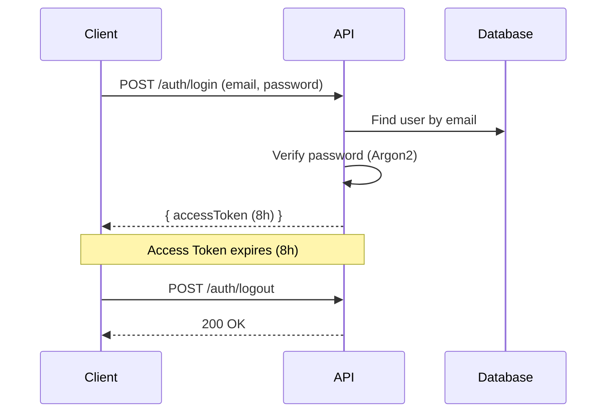

# 03 — Autenticação & Segurança

> **Módulo**: `auth`  
> **Tipo**: Core (não desativável)  
> **Prefixo de rota**: `/api/v1/auth`

---

## 3.1. Estratégia de Autenticação

### Fluxo JWT Simples



### Tokens

| Token            | Tipo | Expiração | Storage         | Conteúdo                             |
|------------------|------|-----------|-----------------|--------------------------------------|
| **Access Token** | JWT  | 8 horas   | Memory (client) | `{ userId, role, companyId, email }` |

### Access Token Payload

```typescript
interface AccessTokenPayload {
  sub: string;        // user.id (UUID)
  email: string;      // user.email
  role: UserRole;     // 'SUPER_ADMIN' | 'SUPPORT' | 'COMPANY_ADMIN' | 'USER'
  companyId?: string; // null for SUPER_ADMIN/SUPPORT
  iat: number;        // Issued at
  exp: number;        // Expiration
  jti: string;        // Unique token ID
}
```

---

## 3.2. Rotas

### `POST /api/v1/auth/login`

**Descrição**: Autenticação com email e senha.

**Request Body**:
```json
{
  "email": "user@company.com",
  "password": "SecureP@ss123"
}
```

**Validação (Zod)**:
```typescript
const loginSchema = z.object({
  email: z.string().email('Email inválido').max(255),
  password: z.string().min(8, 'Mínimo 8 caracteres').max(128),
});
```

**Response 200**:
```json
{
  "success": true,
  "data": {
    "accessToken": "eyJhbGciOiJIUzI1NiIs...",
    "user": {
      "id": "01902abc-...",
      "name": "João Silva",
      "email": "user@company.com",
      "role": "COMPANY_ADMIN",
      "companyId": "01902def-...",
      "companyName": "Empresa X"
    }
  }
}
```

**Response Headers (Set-Cookie)**:
```
**Response 401**:
```json
{
  "success": false,
  "error": {
    "code": "INVALID_CREDENTIALS",
    "message": "Email ou senha incorretos"
  }
}
```

**Response 403** (conta desativada):
```json
{
  "success": false,
  "error": {
    "code": "ACCOUNT_DISABLED",
    "message": "Sua conta está desativada. Entre em contato com o administrador."
  }
}
```

**Regras de Negócio**:
- Máximo 5 tentativas por IP em 15 minutos
- Máximo 10 tentativas por email em 1 hora
- Após lockout, retornar 429 com `Retry-After` header
- Logar tentativas falhas no audit log
- Atualizar `last_login_at` e `last_login_ip` ao sucesso

---

### `POST /api/v1/auth/logout`

**Descrição**: Invalidar sessão atual.

**Headers**: `Authorization: Bearer <accessToken>`

**Response 200**:
```json
{
  "success": true,
  "message": "Logout realizado com sucesso"
}
```

**Regras de Negócio**:
- Invalidar token localmente
- Logar ação no audit log

---

### `POST /api/v1/auth/reset-password`

**Descrição**: Redefinir senha usando token.

**Request Body**:
```json
{
  "token": "rst_abc123...",
  "password": "NewSecureP@ss456",
  "passwordConfirmation": "NewSecureP@ss456"
}
```

**Validação**:
```typescript
const resetPasswordSchema = z.object({
  token: z.string().min(1),
  password: z.string()
    .min(8, 'Mínimo 8 caracteres')
    .max(128)
    .regex(/[A-Z]/, 'Deve conter pelo menos uma maiúscula')
    .regex(/[a-z]/, 'Deve conter pelo menos uma minúscula')
    .regex(/[0-9]/, 'Deve conter pelo menos um número')
    .regex(/[^A-Za-z0-9]/, 'Deve conter pelo menos um caractere especial'),
  passwordConfirmation: z.string(),
}).refine(data => data.password === data.passwordConfirmation, {
  message: 'Senhas não coincidem',
  path: ['passwordConfirmation'],
});
```

**Response 200**:
```json
{
  "success": true,
  "message": "Senha redefinida com sucesso"
}
```

**Regras de Negócio**:
- Validar token no Redis
- Invalidar TODAS as sessões do usuário
- Atualizar hash da senha
- Deletar token do Redis
- Logar ação no audit log

---

### `GET /api/v1/auth/me`

**Descrição**: Retornar dados do usuário logado com permissões e filiais.

**Headers**: `Authorization: Bearer <accessToken>`

**Response 200**:
```json
{
  "success": true,
  "data": {
    "id": "01902abc-...",
    "name": "João Silva",
    "email": "user@company.com",
    "role": "USER",
    "phone": "+5511999999999",
    "avatarUrl": null,
    "company": {
      "id": "01902def-...",
      "name": "Empresa X",
      "slug": "empresa-x"
    },
    "branches": [
      { "id": "01902ghi-...", "name": "Filial Centro", "code": "FC01" },
      { "id": "01902jkl-...", "name": "Filial Sul", "code": "FS01" }
    ],
    "permissions": [
      { "id": "01902mno-...", "name": "Leitor" }
    ]
  }
}
```

---

## 3.3. Segurança de Senhas

### Requisitos de Senha

| Regra | Valor |
|-------|-------|
| Comprimento mínimo | 8 caracteres |
| Comprimento máximo | 128 caracteres |
| Maiúscula obrigatória | Sim (mín. 1) |
| Minúscula obrigatória | Sim (mín. 1) |
| Número obrigatório | Sim (mín. 1) |
| Caractere especial obrigatório | Sim (mín. 1) |
| Hashing | Argon2id |

### Configuração Argon2

```typescript
const ARGON2_CONFIG = {
  type: argon2.argon2id,
  memoryCost: 65536,    // 64 MB
  timeCost: 3,          // 3 iterations
  parallelism: 4,       // 4 threads
};
```

---

## 3.4. Proteções de Segurança

### Headers (Helmet)

```typescript
app.register(helmet, {
  contentSecurityPolicy: {
    directives: {
      defaultSrc: ["'self'"],
      scriptSrc: ["'self'"],
      styleSrc: ["'self'", "'unsafe-inline'"],
      imgSrc: ["'self'", "data:", "https:"],
    },
  },
  hsts: { maxAge: 31536000, includeSubDomains: true },
  referrerPolicy: { policy: 'strict-origin-when-cross-origin' },
});
```

### CORS

```typescript
app.register(cors, {
  origin: env.CORS_ORIGIN,
  credentials: true,
  methods: ['GET', 'POST', 'PUT', 'DELETE', 'PATCH'],
  allowedHeaders: ['Content-Type', 'Authorization'],
  maxAge: 86400,
});
```

### Brute Force Protection

```typescript
// Rate limiting específico para auth
const authRateLimit = {
  max: 5,
  timeWindow: '15 minutes',
  keyGenerator: (req) => req.ip,
  errorResponseBuilder: () => ({
    success: false,
    error: {
      code: 'TOO_MANY_REQUESTS',
      message: 'Muitas tentativas. Tente novamente em 15 minutos.',
    },
  }),
};
```

---

## 3.5. Testes E2E — Auth

```typescript
describe('Auth Module E2E', () => {
  // Login
  describe('POST /api/v1/auth/login', () => {
    it('should login with valid credentials and return access token');
    it('should return 401 for invalid email');
    it('should return 401 for invalid password');
    it('should return 403 for disabled account');
    it('should update last_login_at and last_login_ip');
    it('should create audit log entry for successful login');
    it('should create audit log entry for failed login attempt');
    it('should return 429 after 5 failed attempts from same IP');
    it('should return 422 for invalid email format');
    it('should return 422 for missing password');
  });

  // Logout
  describe('POST /api/v1/auth/logout', () => {
    it('should return 401 without auth header');
    it('should create audit log entry');
  });

  // Forgot Password
  describe('POST /api/v1/auth/forgot-password', () => {
    it('should return 200 for existing email');
    it('should return 200 for non-existing email (no info leak)');
    it('should rate limit to 3 requests per email per hour');
    it('should return 422 for invalid email format');
  });

  // Reset Password
  describe('POST /api/v1/auth/reset-password', () => {
    it('should reset password with valid token');
    it('should invalidate all user sessions after reset');
    it('should return 400 for expired token');
    it('should return 400 for already-used token');
    it('should return 422 for weak password');
    it('should return 422 when passwords dont match');
    it('should create audit log entry');
  });

  // Me
  describe('GET /api/v1/auth/me', () => {
    it('should return full user profile with permissions and branches');
    it('should return permissions for user');
    it('should return 401 without auth header');
    it('should return 401 with expired access token');
    it('should return correct data for SUPER_ADMIN (no company)');
    it('should return correct data for COMPANY_ADMIN');
    it('should return correct data for USER with multiple branches');
  });
});
```
