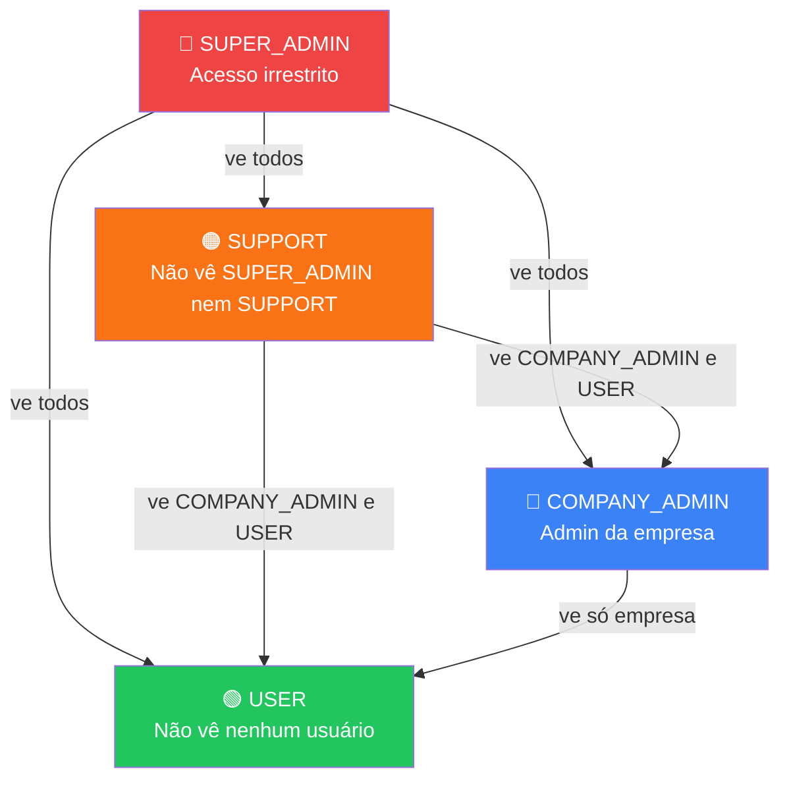

# 04 — Usuários & Tipos de Usuário

> **Prefixo de rota**: `/api/v1/users`

---

## 4.1. Hierarquia de Usuários



### Matriz de Capacidades

Capacidade,SUPER_ADMIN,SUPPORT,COMPANY_ADMIN,USER
Ver empresas,✅,✅,❌,❌
Criar empresa,✅,✅,❌,❌
Editar empresa,✅,❌,❌,❌
Deletar empresa,✅,❌,❌,❌
Ver usuários,Todos,COMPANY_ADMIN + USER,Própria empresa,❌
Ver suportes,✅,❌,❌,❌
Criar usuários,✅ (todos),✅ (COMPANY_ADMIN + USER),✅ (USER da empresa),❌
Editar usuários,✅,❌,✅ (USER da empresa),❌
Deletar usuários,✅,❌,✅ (USER da empresa),❌
Resetar senha (empresa),✅,✅,❌,❌
Ativar/desativar usuários,✅,❌,✅ (USER da empresa),❌
Criar filial,✅,❌,✅ (própria empresa),❌
Gerenciar permissões,❌,❌,✅ (na empresa),❌
Ver audit logs,✅,✅,❌,❌

---

## 4.2. Rotas

### `GET /api/v1/users`

**Descrição**: Listar usuários com paginação e filtros.

**Headers**: `Authorization: Bearer <token>`

**Query Parameters**:
| Param | Tipo | Default | Descrição |
|-------|------|---------|-----------|
| `page` | number | 1 | Página atual |
| `limit` | number | 20 | Itens por página (max: 100) |
| `search` | string | - | Busca por nome ou email |
| `role` | string | - | Filtrar por role |
| `companyId` | uuid | - | Filtrar por empresa (SUPER_ADMIN/SUPPORT) |
| `branchId` | uuid | - | Filtrar por filial |
| `isActive` | boolean | - | Filtrar por status |
| `sortBy` | string | `createdAt` | Campo de ordenação |
| `sortOrder` | string | `desc` | `asc` ou `desc` |

**Regras de Escopo**:
- `SUPER_ADMIN`: vê todos os usuários (SUPER_ADMIN, SUPPORT, COMPANY_ADMIN, USER)
- `SUPPORT`: vê COMPANY_ADMIN e USER de todas empresas (não vê SUPER_ADMIN nem outros SUPPORT)
- `COMPANY_ADMIN`: vê apenas usuários da sua empresa
- `USER`: ❌ retorna lista vazia

**Response 200**:
```json
{
  "success": true,
  "data": [
    {
      "id": "01902abc-...",
      "name": "João Silva",
      "email": "joao@empresa.com",
      "role": "USER",
      "phone": "+5511999999999",
      "isActive": true,
      "company": {
        "id": "01902def-...",
        "name": "Empresa X"
      },
      "branchCount": 2,
      "permissionCount": 1,
      "lastLoginAt": "2024-01-15T10:30:00Z",
      "createdAt": "2024-01-01T00:00:00Z"
    }
  ],
  "pagination": {
    "page": 1,
    "limit": 20,
    "total": 45,
    "totalPages": 3
  }
}
```

---

### `GET /api/v1/users/:id`

**Descrição**: Detalhe completo do usuário.

**Response 200**:
```json
{
  "success": true,
  "data": {
    "id": "01902abc-...",
    "name": "João Silva",
    "email": "joao@empresa.com",
    "role": "USER",
    "phone": "+5511999999999",
    "avatarUrl": null,
    "isActive": true,
    "emailVerified": true,
    "company": {
      "id": "01902def-...",
      "name": "Empresa X",
      "slug": "empresa-x"
    },
    "branches": [
      {
        "id": "01902ghi-...",
        "name": "Filial Centro",
        "code": "FC01",
        "assignedAt": "2024-01-05T00:00:00Z",
        "assignedBy": { "id": "...", "name": "Admin" }
      }
    ],
    "permissions": ["search", "justify_pending", ...],
    "metadata": { "preferences": { "theme": "dark" } },
    "lastLoginAt": "2024-01-15T10:30:00Z",
    "lastLoginIp": "189.45.32.10",
    "createdAt": "2024-01-01T00:00:00Z",
    "updatedAt": "2024-01-15T10:30:00Z"
  }
}
```

**Regras de Escopo**:
- `SUPER_ADMIN`: pode ver qualquer usuário
- `SUPPORT`: pode ver qualquer usuário (exceto outros SUPPORT e SUPER_ADMINs)
- `COMPANY_ADMIN`: pode ver apenas usuários da sua empresa
- `USER`: pode ver apenas a si mesmo (via `/auth/me`)

---

### `POST /api/v1/users`

**Descrição**: Criar novo usuário.

**Request Body**:
```json
{
  "name": "Maria Santos",
  "email": "maria@empresa.com",
  "password": "SecureP@ss123",
  "role": "USER",
  "companyId": "01902def-...",
  "phone": "+5511988888888",
  "branchIds": ["01902ghi-...", "01902jkl-..."]
}
```

**Validação**:
```typescript
const createUserSchema = z.object({
  name: z.string().min(2).max(255),
  email: z.string().email().max(255),
  password: passwordSchema,
  role: z.enum(['SUPER_ADMIN', 'SUPPORT', 'COMPANY_ADMIN', 'USER']),
  companyId: z.string().uuid().optional(),
  phone: z.string().max(20).optional(),
  branchIds: z.array(z.string().uuid()).optional(),
});
```

**Regras de Negócio**:
- `SUPER_ADMIN` pode criar qualquer tipo
- `COMPANY_ADMIN` pode criar apenas `USER` dentro da sua empresa
- `SUPPORT` pode criar `COMPANY_ADMIN` e `USER`
- `companyId` é obrigatório para `COMPANY_ADMIN` e `USER`
- `companyId` é proibido para `SUPER_ADMIN` e `SUPPORT`
- Filiais (`branchIds`) devem pertencer à empresa do usuário
- Email deve ser único globalmente
- Senha é armazenada como hash Argon2
- Permissões são atribuídas separadamente via `PUT /users/:id/permissions`

**Response 201**:
```json
{
  "success": true,
  "data": {
    "id": "01903xyz-...",
    "name": "Maria Santos",
    "email": "maria@empresa.com",
    "role": "USER",
    "isActive": true,
    "createdAt": "2024-01-16T00:00:00Z"
  }
}
```

---

### `PUT /api/v1/users/:id`

**Descrição**: Atualizar dados do usuário.

**Request Body** (campos opcionais):
```json
{
  "name": "Maria Santos Oliveira",
  "phone": "+5511977777777",
  "isActive": false,
  "metadata": {
    "preferences": { "theme": "dark" }
  }
}
```

**Regras de Negócio**:
- Não é possível alterar `email` ou `role` por esta rota
- Para alterar senha, usar `/auth/reset-password`
- `SUPER_ADMIN` pode editar qualquer usuário
- `SUPPORT` pode editar `COMPANY_ADMIN` e `USER`
- `COMPANY_ADMIN` pode editar apenas `USER`s da sua empresa
- `USER` não pode editar ninguém, apenas a si mesmo
- Ao desativar (`isActive: false`), todas as sessões são invalidadas
- Logar alterações no audit log com old/new values

---

### `DELETE /api/v1/users/:id`

**Descrição**: Soft delete — desativar usuário.

**Regras de Negócio**:
- `SUPER_ADMIN` pode desativar qualquer usuário (exceto a si mesmo)
- `SUPPORT` pode desativar `COMPANY_ADMIN` e `USER`
- `COMPANY_ADMIN` pode desativar apenas `USER`s da sua empresa
- `USER` não pode desativar ninguém, nem a si mesmo
- **Não é possível deletar o último SUPER_ADMIN** (proteção)
- Soft delete: `deleted_at` é preenchido, `is_active = false`
- Todas as sessões do usuário são invalidadas
- Audit log registrado

**Response 200**:
```json
{
  "success": true,
  "message": "Usuário desativado com sucesso"
}
```

---

### `PUT /api/v1/users/:id/branches`

**Descrição**: Atribuir/remover filiais de um usuário.

**Request Body**:
```json
{
  "branchIds": ["01902ghi-...", "01902jkl-..."]
}
```

**Regras de Negócio**:
- Substitui TODAS as atribuições (full sync)
- Array vazio remove todas as filiais
- Filiais devem pertencer à mesma empresa do usuário
- Apenas `COMPANY_ADMIN` da empresa ou `SUPER_ADMIN`
- Registra quem fez a atribuição (`assigned_by`)

---

### `PUT /api/v1/users/:id/permissions`

**Descrição**: Atribuir/remover permissões de um usuário.

**Request Body**:
```json
{
  "permissionIds": ["01902mno-...", "01902pqr-..."]
}
```

**Regras de Negócio**:
- Substitui TODAS as atribuições (full sync)
- Array vazio remove todas as permissões
- Permissões devem pertencer à mesma empresa do usuário
- Apenas `COMPANY_ADMIN` da empresa ou `SUPER_ADMIN` ou `SUPPORT`
- Registra quem fez a atribuição (`assigned_by`)

---

### `POST /api/v1/users/:id/reset-password`

**Descrição**: Resetar senha de um usuário (por admin/suporte/super_admin).

**Request Body**:
```json
{
  "newPassword": "NovaSenha@123"
}
```

**Validação**:
```typescript
const resetPasswordSchema = z.object({
  newPassword: z.string()
    .min(8, 'Mínimo 8 caracteres')
    .regex(/[A-Z]/, 'Deve conter pelo menos uma maiúscula')
    .regex(/[0-9]/, 'Deve conter pelo menos um número')
    .regex(/[^A-Za-z0-9]/, 'Deve conter pelo menos um caractere especial'),
});
```

**Regras de Negócio**:
- `SUPER_ADMIN`: pode resetar senha de qualquer usuário
- `SUPPORT`: pode resetar senha de usuários de ADMIN e USER
- `COMPANY_ADMIN`: pode resetar senha de usuários de USER
- `USER`: não pode resetar senha de ninguém, exceto a si mesmo
- Nova senha invalida todas as sessões existentes do usuário
- Audit log registrado

**Response 200**:
```json
{
  "success": true,
  "message": "Senha redefinida com sucesso"
}
```

---

## 4.3. Testes E2E — Users

```typescript
describe('Users Module E2E', () => {
  // List
  describe('GET /api/v1/users', () => {
    it('should list users with pagination');
    it('should filter by role');
    it('should filter by company (SUPER_ADMIN)');
    it('should filter by branch');
    it('should search by name');
    it('should search by email');
    it('should filter by isActive');
    it('should sort by createdAt desc by default');
    it('should scope results to own company for COMPANY_ADMIN');
    it('should return 403 for USER role');
    it('should not expose SUPER_ADMIN to SUPPORT role');
  });

  // Detail
  describe('GET /api/v1/users/:id', () => {
    it('should return full user profile with branches and permissions');
    it('should return 404 for non-existent user');
    it('should return 403 when COMPANY_ADMIN tries to view user from another company');
    it('should allow SUPER_ADMIN to view any user');
  });

  // Create
  describe('POST /api/v1/users', () => {
    it('should create USER within own company as COMPANY_ADMIN');
    it('should create any type as SUPER_ADMIN');
    it('should return 403 when COMPANY_ADMIN tries to create COMPANY_ADMIN');
    it('should return 403 for SUPPORT role');
    it('should return 409 for duplicate email');
    it('should assign branches and permissions on creation');
    it('should return 400 when branchIds belong to different company');
    it('should return 422 for invalid email format');
    it('should return 422 for weak password');
    it('should hash password before storing');
    it('should create audit log entry');
  });

  // Update
  describe('PUT /api/v1/users/:id', () => {
    it('should update user name and phone');
    it('should invalidate sessions when setting isActive to false');
    it('should return 403 when COMPANY_ADMIN tries to edit user from another company');
    it('should not allow changing email via this route');
    it('should not allow changing role via this route');
    it('should create audit log with old/new values');
  });

  // Delete
  describe('DELETE /api/v1/users/:id', () => {
    it('should soft delete user');
    it('should invalidate all user sessions');
    it('should return 400 when trying to delete last SUPER_ADMIN');
    it('should return 400 when trying to delete yourself');
    it('should return 403 when COMPANY_ADMIN tries to delete user from another company');
    it('should create audit log entry');
  });

  // Branch assignment
  describe('PUT /api/v1/users/:id/branches', () => {
    it('should assign multiple branches to user');
    it('should replace existing branch assignments');
    it('should remove all branches with empty array');
    it('should return 400 for branches from different company');
    it('should record assigned_by');
    it('should create audit log entry');
  });

  // Permission assignment
  describe('PUT /api/v1/users/:id/permissions', () => {
    it('should assign multiple permissions to user');
    it('should replace existing permission assignments');
    it('should remove all permissions with empty array');
    it('should return 400 for permissions from different company');
    it('should record assigned_by');
    it('should create audit log entry');
  });
});
```
