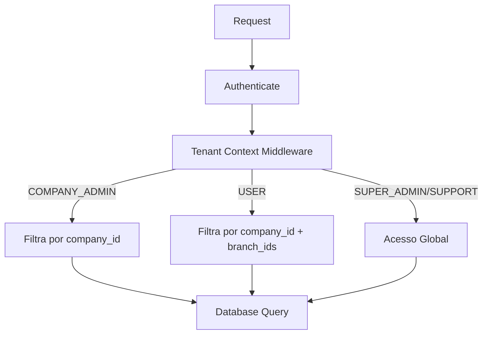

# 05 — Empresas (Tenants)

> **Prefixo de rota**: `/api/v1/companies`

---

## 5.1. Visão Geral

Empresas (companies) são a unidade de tenant do sistema. Cada empresa:
- Possui suas próprias filiais, usuários, permissões
- Tem módulos habilitados independentemente
- Possui isolamento de dados via middleware `tenant-context`
- Pode ter configurações customizadas (JSONB `settings`)

### Isolamento de Dados (Tenant Isolation)



O middleware `tenant-context` injeta automaticamente:
```typescript
interface TenantContext {
  companyId: string | null;     // null para SUPER_ADMIN/SUPPORT
  branchIds: string[];          // Filiais que o USER tem acesso
  role: UserRole;
}

// Injetado em request
declare module 'fastify' {
  interface FastifyRequest {
    tenant: TenantContext;
    user: AccessTokenPayload;
  }
}
```

---

## 5.2. Rotas

### `GET /api/v1/companies`

**Descrição**: Listar empresas.

**Permissão**: `SUPER_ADMIN`, `SUPPORT`

**Query Parameters**:
| Param | Tipo | Default | Descrição |
|-------|------|---------|-----------|
| `page` | number | 1 | Página |
| `limit` | number | 20 | Itens por página |
| `search` | string | - | Busca por nome ou CNPJ |
| `isActive` | boolean | - | Filtrar por status |
| `sortBy` | string | `createdAt` | Ordenação |
| `sortOrder` | string | `desc` | Direção |

**Response 200**:
```json
{
  "success": true,
  "data": [
    {
      "id": "01902def-...",
      "name": "Empresa X Ltda",
      "slug": "empresa-x",
      "document": "12.345.678/0001-99",
      "email": "contato@empresax.com",
      "phone": "+5511988887777",
      "isActive": true,
      "stats": {
        "branchCount": 3,
        "userCount": 15,
        "permissionsCount": 3
      },
      "createdAt": "2024-01-01T00:00:00Z"
    }
  ],
  "pagination": {
    "page": 1,
    "limit": 20,
    "total": 12,
    "totalPages": 1
  }
}
```

---

### `GET /api/v1/companies/:id`

**Descrição**: Detalhe completo da empresa.

**Permissão**: `SUPER_ADMIN`, `SUPPORT`, `COMPANY_ADMIN` (própria)

**Response 200**:
```json
{
  "success": true,
  "data": {
    "id": "01902def-...",
    "name": "Empresa X Ltda",
    "slug": "empresa-x",
    "email": "contato@empresax.com",
    "settings": {
      "timezone": "America/Sao_Paulo",
      "locale": "pt-BR",
      "maxUsers": 50,
      "maxBranches": 10,
      "theme": {
        "primaryColor": "#3b82f6",
        "logoUrl": null
      }
    },
    "isActive": true,
    "stats": {
      "branchCount": 3,
      "activeBranches": 3,
      "userCount": 15,
      "activeUsers": 13,
      "permissionsCount": 3,
      "permissionCount": 4
    },
    "createdAt": "2024-01-01T00:00:00Z",
    "updatedAt": "2024-01-10T00:00:00Z"
  }
}
```

---

### `POST /api/v1/companies`

**Descrição**: Criar nova empresa.

**Permissão**: `SUPER_ADMIN` apenas

**Request Body**:
```json
{
  "name": "Nova Empresa Ltda",
  "slug": "nova-empresa",
  "email": "admin@novaempresa.com",
  "settings": {
    "timezone": "America/Sao_Paulo",
    "locale": "pt-BR",
    "maxUsers": 100,
    "maxBranches": 20
  },
  "adminUser": {
    "name": "Admin Nova Empresa",
    "email": "admin@novaempresa.com",
    "password": "AdminP@ss2024!"
  }
}
```

**Validação**:
```typescript
const createCompanySchema = z.object({
  name: z.string().min(2).max(255),
  slug: z.string().min(2).max(100).regex(/^[a-z0-9-]+$/, 'Slug deve conter apenas letras minúsculas, números e hífens'),
  document: z.string().max(20).optional(),
  email: z.string().email().optional(),
  phone: z.string().max(20).optional(),
  settings: companySettingsSchema.optional(),
  adminUser: z.object({
    name: z.string().min(2).max(255),
    email: z.string().email(),
    password: passwordSchema,
  }),
});
```

**Regras de Negócio**:
- Cria a empresa + admin user em uma **transação**
- O admin user é criado com role `COMPANY_ADMIN`
- Slug deve ser único
- Módulos core são habilitados automaticamente
- Audit log registrado

**Response 201**:
```json
{
  "success": true,
  "data": {
    "id": "01903xyz-...",
    "name": "Nova Empresa Ltda",
    "slug": "nova-empresa",
    "adminUser": {
      "id": "01903abc-...",
      "email": "admin@novaempresa.com"
    },
    "createdAt": "2024-01-16T00:00:00Z"
  }
}
```

---

### `PUT /api/v1/companies/:id`

**Descrição**: Atualizar dados da empresa.

**Permissão**: `SUPER_ADMIN`, `COMPANY_ADMIN` (própria)

**Request Body** (campos opcionais):
```json
{
  "name": "Empresa X — Novo Nome",
  "email": "novo@empresax.com",
  "settings": {
    "timezone": "America/Sao_Paulo",
    "maxUsers": 100
  }
}
```

**Restrições COMPANY_ADMIN**:
- Não pode alterar `slug`
- Não pode alterar `isActive`
- Não pode alterar `maxUsers` ou `maxBranches` nos settings
- Pode alterar: `name`, `email`, `theme` (dentro de settings)

---

### `DELETE /api/v1/companies/:id`

**Descrição**: Soft delete da empresa.

**Permissão**: `SUPER_ADMIN` apenas

**Regras de Negócio**:
- Soft delete: `deleted_at` preenchido, `is_active = false`
- Desativa TODOS os usuários da empresa
- Invalida TODAS as sessões dos usuários da empresa
- Desativa TODAS as filiais
- **NÃO deleta dados** (soft delete em cascata)
- Audit log registrado com detalhes completos

---

### `GET /api/v1/companies/:id/stats`

**Descrição**: Estatísticas da empresa.

**Permissão**: `SUPER_ADMIN`, `SUPPORT`, `COMPANY_ADMIN` (própria)

**Response 200**:
```json
{
  "success": true,
  "data": {
    "users": {
      "total": 15,
      "active": 13,
      "inactive": 2,
      "byRole": {
        "COMPANY_ADMIN": 2,
        "USER": 13
      }
    },
    "branches": {
      "total": 3,
      "active": 3
    },
    "permissions": {
      "total": 4
    },
    "auditLogs": {
      "last24h": 142,
      "last7d": 856,
      "last30d": 3421
    }
  }
}
```

---

## 5.3. Testes E2E — Companies

```typescript
describe('Companies Module E2E', () => {
  // List
  describe('GET /api/v1/companies', () => {
    it('should list companies with pagination for SUPER_ADMIN');
    it('should list companies for SUPPORT');
    it('should return 403 for COMPANY_ADMIN');
    it('should return 403 for USER');
    it('should filter by search (name)');
    it('should filter by search (CNPJ)');
    it('should filter by isActive');
    it('should include stats (branchCount, userCount)');
  });

  // Detail
  describe('GET /api/v1/companies/:id', () => {
    it('should return full company detail for SUPER_ADMIN');
    it('should return own company for COMPANY_ADMIN');
    it('should return 403 when COMPANY_ADMIN tries to view another company');
    it('should return 404 for non-existent company');
    it('should include modules list');
  });

  // Create
  describe('POST /api/v1/companies', () => {
    it('should create company with admin user');
    it('should return 409 for duplicate slug');
    it('should return 403 for non-SUPER_ADMIN');
    it('should return 422 for invalid slug format');
    it('should create audit log entry');
  });

  // Update
  describe('PUT /api/v1/companies/:id', () => {
    it('should update company as SUPER_ADMIN');
    it('should update own company as COMPANY_ADMIN (restricted fields)');
    it('should return 403 when COMPANY_ADMIN tries restricted fields');
    it('should return 403 for another company');
    it('should merge settings correctly (partial update)');
    it('should create audit log with old/new values');
  });

  // Delete
  describe('DELETE /api/v1/companies/:id', () => {
    it('should soft delete company');
    it('should deactivate all company users');
    it('should invalidate all company sessions');
    it('should deactivate all company branches');
    it('should return 403 for non-SUPER_ADMIN');
    it('should create comprehensive audit log');
  });

  // Stats
  describe('GET /api/v1/companies/:id/stats', () => {
    it('should return detailed statistics');
    it('should return own company stats for COMPANY_ADMIN');
    it('should return 403 for another company');
  });
});
```
