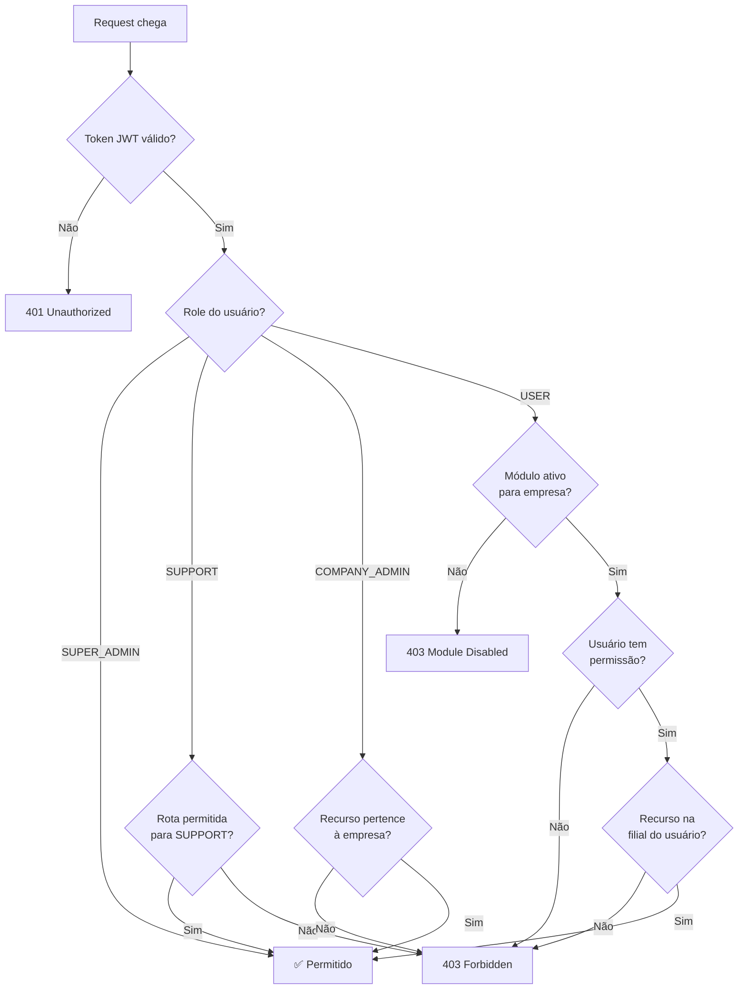

# 07 — Permissões & RBAC

> **Módulo**: `permissions`  
> **Tipo**: Core (não desativável)  
> **Prefixo de rota**: `/api/v1/permissions`

---

## 7.1. Visão Geral

O sistema de permissões do cenos é baseado em **RBAC (Role-Based Access Control)** com granularidade a nível de módulo e ação.

### Conceitos

| Conceito | Descrição | Exemplo |
|----------|-----------|---------|
| **Role** | Tipo fixo do usuário (4 tipos) | `SUPER_ADMIN`, `SUPPORT`, `COMPANY_ADMIN`, `USER` |
| **Permission** | Grupo nomeado de acessos a módulos | "Leitor", "Editor", "Gestor de Filiais" |
| **Module** | Feature do sistema que pode ser ativada/desativada | `users`, `branches`, `audit` |
| **Action** | Operação dentro de um módulo | `read`, `create`, `update`, `delete`, `export` |

### Fluxo de Verificação



### Middleware `authorize`

```typescript
// Uso nas rotas:
app.get('/api/v1/users',
  authenticate,                          // Verifica JWT
  moduleGuard('users'),                  // Verifica se módulo 'users' está ativo
  authorize({
    roles: ['SUPER_ADMIN', 'SUPPORT', 'COMPANY_ADMIN'],  // Roles permitidos
    // OU
    permission: { module: 'users', action: 'read' },      // Para USERs: verificar permissão
  }),
  usersController.list,
);
```

### Implementação do `authorize` middleware

```typescript
interface AuthorizeOptions {
  roles?: UserRole[];
  permission?: {
    module: string;
    action: string;
  };
}

async function authorize(options: AuthorizeOptions) {
  return async (request: FastifyRequest, reply: FastifyReply) => {
    const { role } = request.user;
    
    // SUPER_ADMIN bypassa tudo
    if (role === 'SUPER_ADMIN') return;
    
    // Verificar role
    if (options.roles && !options.roles.includes(role)) {
      // Se o user é USER e tem permission config, verificar permissão
      if (role === 'USER' && options.permission) {
        const hasPermission = await checkUserPermission(
          request.user.sub,
          options.permission.module,
          options.permission.action,
        );
        if (!hasPermission) {
          return reply.code(403).send({
            success: false,
            error: { code: 'FORBIDDEN', message: 'Permissão insuficiente' },
          });
        }
        return; // Permitido via permissão
      }
      return reply.code(403).send({
        success: false,
        error: { code: 'FORBIDDEN', message: 'Acesso negado para este role' },
      });
    }
  };
}
```

### Cache de Permissões

As permissões do usuário são cacheadas no Redis por **5 minutos** para evitar queries repetidas:

```typescript
// Key: permissions:user:<userId>
// Value: JSON com todas as permissões resolvidas
// TTL: 300 seconds

interface CachedPermissions {
  permissions: Array<{
    moduleId: string;
    actions: string[];
  }>;
  branchIds: string[];
  cachedAt: string;
}
```

Quando permissões são alteradas (`PUT /users/:id/permissions`), o cache é **invalidado imediatamente**.

---

## 7.2. Rotas

### `GET /api/v1/permissions`

**Descrição**: Listar permissões da empresa.

**Permissão**: `COMPANY_ADMIN` (própria empresa), `SUPER_ADMIN`

**Query Parameters**:
| Param | Tipo | Default | Descrição |
|-------|------|---------|-----------|
| `page` | number | 1 | Página |
| `limit` | number | 20 | Itens por página |
| `search` | string | - | Busca por nome |
| `isActive` | boolean | - | Filtrar por status |
| `companyId` | uuid | - | Filtrar por empresa (SUPER_ADMIN) |

**Response 200**:
```json
{
  "success": true,
  "data": [
    {
      "id": "01902mno-...",
      "name": "Leitor",
      "slug": "leitor",
      "description": "Pode visualizar informações de usuários e filiais",
      "isActive": true,
      "modules": [
        { "moduleId": "users", "moduleName": "Usuários", "actions": ["read"] },
        { "moduleId": "branches", "moduleName": "Filiais", "actions": ["read"] }
      ],
      "userCount": 5,
      "createdAt": "2024-01-05T00:00:00Z"
    },
    {
      "id": "01902pqr-...",
      "name": "Editor",
      "slug": "editor",
      "description": "Pode visualizar e editar informações",
      "isActive": true,
      "modules": [
        { "moduleId": "users", "moduleName": "Usuários", "actions": ["read", "update"] },
        { "moduleId": "branches", "moduleName": "Filiais", "actions": ["read", "update"] }
      ],
      "userCount": 3,
      "createdAt": "2024-01-05T00:00:00Z"
    },
    {
      "id": "01902stu-...",
      "name": "Gestor Completo",
      "slug": "gestor-completo",
      "description": "Acesso total a todos os módulos habilitados",
      "isActive": true,
      "modules": [
        { "moduleId": "users", "moduleName": "Usuários", "actions": ["read", "create", "update", "delete"] },
        { "moduleId": "branches", "moduleName": "Filiais", "actions": ["read", "create", "update", "delete"] },
        { "moduleId": "audit", "moduleName": "Auditoria", "actions": ["read", "export"] }
      ],
      "userCount": 1,
      "createdAt": "2024-01-05T00:00:00Z"
    }
  ],
  "pagination": { "page": 1, "limit": 20, "total": 3, "totalPages": 1 }
}
```

---

### `GET /api/v1/permissions/:id`

**Descrição**: Detalhe completo da permissão com usuários atribuídos.

**Response 200**:
```json
{
  "success": true,
  "data": {
    "id": "01902mno-...",
    "name": "Leitor",
    "slug": "leitor",
    "description": "Pode visualizar informações de usuários e filiais",
    "isActive": true,
    "modules": [
      {
        "moduleId": "users",
        "moduleName": "Usuários",
        "actions": ["read"],
        "availableActions": ["read", "create", "update", "delete", "export"]
      },
      {
        "moduleId": "branches",
        "moduleName": "Filiais",
        "actions": ["read"],
        "availableActions": ["read", "create", "update", "delete"]
      }
    ],
    "users": [
      {
        "id": "01902abc-...",
        "name": "João Silva",
        "email": "joao@empresa.com",
        "assignedAt": "2024-01-05T00:00:00Z"
      }
    ],
    "metadata": {},
    "createdAt": "2024-01-05T00:00:00Z",
    "updatedAt": "2024-01-05T00:00:00Z"
  }
}
```

---

### `POST /api/v1/permissions`

**Descrição**: Criar nova permissão.

**Permissão**: `COMPANY_ADMIN` (própria empresa), `SUPER_ADMIN`

**Request Body**:
```json
{
  "name": "Auditor",
  "description": "Pode visualizar logs de auditoria e exportar relatórios",
  "modules": [
    { "moduleId": "audit", "actions": ["read", "export"] },
    { "moduleId": "users", "actions": ["read"] }
  ]
}
```

**Validação**:
```typescript
const createPermissionSchema = z.object({
  name: z.string().min(2).max(255),
  description: z.string().max(500).optional(),
  modules: z.array(z.object({
    moduleId: z.string().min(1),
    actions: z.array(z.enum(['read', 'create', 'update', 'delete', 'export'])).min(1),
  })).min(1, 'Pelo menos um módulo deve ser incluído'),
  metadata: z.record(z.unknown()).optional(),
});
```

**Regras de Negócio**:
- `slug` é gerado automaticamente a partir do `name` (slugify)
- `slug` deve ser único dentro da empresa
- Módulos referenciados devem estar **habilitados** para a empresa
- `COMPANY_ADMIN`: `companyId` é auto-preenchido pelo tenant context
- Ações devem ser válidas para o módulo
- Audit log registrado

**Response 201**:
```json
{
  "success": true,
  "data": {
    "id": "01903xyz-...",
    "name": "Auditor",
    "slug": "auditor",
    "modules": [
      { "moduleId": "audit", "actions": ["read", "export"] },
      { "moduleId": "users", "actions": ["read"] }
    ],
    "createdAt": "2024-01-16T00:00:00Z"
  }
}
```

---

### `PUT /api/v1/permissions/:id`

**Descrição**: Atualizar permissão (nome, descrição, módulos).

**Request Body** (campos opcionais):
```json
{
  "name": "Auditor Avançado",
  "description": "Acesso ampliado a auditoria",
  "modules": [
    { "moduleId": "audit", "actions": ["read", "export"] },
    { "moduleId": "users", "actions": ["read", "update"] },
    { "moduleId": "branches", "actions": ["read"] }
  ]
}
```

**Regras de Negócio**:
- Se `modules` for fornecido, substitui **todos** os módulos (full sync)
- Atualiza `slug` se `name` mudar
- Invalida cache de permissões de TODOS os usuários que possuem esta permissão
- Audit log registrado com old/new values

---

### `DELETE /api/v1/permissions/:id`

**Descrição**: Soft delete da permissão.

**Regras de Negócio**:
- Soft delete: `is_active = false`, `deleted_at` preenchido
- Remove atribuições de todos os usuários (`user_permissions`)
- Invalida cache de permissões dos usuários afetados
- Audit log registrado

---

### `GET /api/v1/permissions/modules`

**Descrição**: Listar módulos disponíveis com suas ações, para uso na UI de criação de permissões.

**Permissão**: `COMPANY_ADMIN`

**Response 200**:
```json
{
  "success": true,
  "data": [
    {
      "id": "users",
      "name": "Usuários",
      "description": "Gerenciamento de usuários",
      "actions": [
        { "id": "read", "label": "Visualizar" },
        { "id": "create", "label": "Criar" },
        { "id": "update", "label": "Editar" },
        { "id": "delete", "label": "Remover" },
        { "id": "export", "label": "Exportar" }
      ]
    },
    {
      "id": "branches",
      "name": "Filiais",
      "description": "Gerenciamento de filiais",
      "actions": [
        { "id": "read", "label": "Visualizar" },
        { "id": "create", "label": "Criar" },
        { "id": "update", "label": "Editar" },
        { "id": "delete", "label": "Remover" }
      ]
    },
    {
      "id": "audit",
      "name": "Auditoria",
      "description": "Logs de auditoria",
      "actions": [
        { "id": "read", "label": "Visualizar" },
        { "id": "export", "label": "Exportar" }
      ]
    }
  ]
}
```

**Nota**: Retorna apenas módulos **habilitados para a empresa** do COMPANY_ADMIN.

---

## 7.3. Exemplos de Permissões Comuns

| Permissão | Módulos / Ações | Uso Típico |
|-----------|----------------|------------|
| **Leitor** | `users:read`, `branches:read` | Visualização básica |
| **Editor** | `users:read+update`, `branches:read+update` | Edição sem criar/deletar |
| **Gestor de Usuários** | `users:*` | CRUD completo de usuários |
| **Gestor de Filiais** | `branches:*` | CRUD completo de filiais |
| **Auditor** | `audit:read+export` | Visualizar e exportar logs |
| **Admin Total** | Todos os módulos: `*` | Acesso similar ao COMPANY_ADMIN mas sem poder de criar permissões |

---

## 7.4. Testes E2E — Permissions

```typescript
describe('Permissions Module E2E', () => {
  // List
  describe('GET /api/v1/permissions', () => {
    it('should list permissions for COMPANY_ADMIN');
    it('should scope to own company');
    it('should list all permissions for SUPER_ADMIN with companyId filter');
    it('should include module details and user count');
    it('should paginate results');
    it('should search by name');
    it('should return 403 for USER');
    it('should return 403 for SUPPORT');
  });

  // Detail
  describe('GET /api/v1/permissions/:id', () => {
    it('should return full permission with assigned users');
    it('should include available actions per module');
    it('should return 403 for other company');
    it('should return 404 for non-existent permission');
  });

  // Create
  describe('POST /api/v1/permissions', () => {
    it('should create permission with modules and actions');
    it('should auto-generate slug from name');
    it('should return 409 for duplicate slug within company');
    it('should allow same slug in different companies');
    it('should return 400 for disabled module');
    it('should return 422 for invalid actions');
    it('should return 422 for empty modules array');
    it('should create audit log entry');
  });

  // Update
  describe('PUT /api/v1/permissions/:id', () => {
    it('should update permission name and description');
    it('should replace all modules when modules provided');
    it('should update slug when name changes');
    it('should invalidate permission cache for affected users');
    it('should return 403 for other company');
    it('should create audit log with old/new values');
  });

  // Delete
  describe('DELETE /api/v1/permissions/:id', () => {
    it('should soft delete permission');
    it('should remove all user assignments');
    it('should invalidate cache for affected users');
    it('should return 403 for other company');
    it('should create audit log entry');
  });

  // Available Modules
  describe('GET /api/v1/permissions/modules', () => {
    it('should return only enabled modules for company');
    it('should include all available actions per module');
    it('should return 403 for USER');
  });

  // Integration: Permission check
  describe('Permission Authorization Integration', () => {
    it('should allow USER with read permission to GET resource');
    it('should deny USER without read permission to GET resource');
    it('should allow USER with create permission to POST resource');
    it('should deny USER without create permission to POST resource');
    it('should allow USER with update permission to PUT resource');
    it('should deny USER with only read permission to PUT resource');
    it('should deny USER with delete permission on disabled module');
    it('should re-evaluate after permission update (cache invalidation)');
  });
});
```
