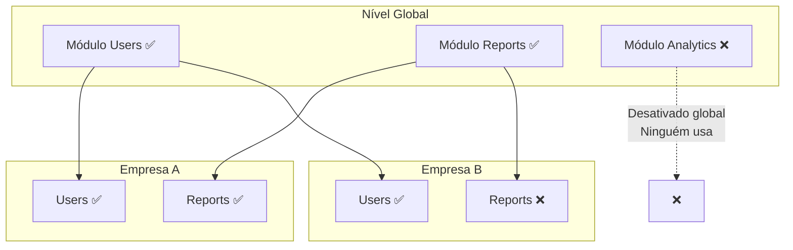

# 08 — Sistema de Módulos (Feature Flags)

> **Módulo**: `modules`  
> **Tipo**: Core (não desativável)  
> **Prefixo de rota**: `/api/v1/modules`

---

## 8.1. Visão Geral

O sistema de módulos permite ativar/desativar features do sistema em dois níveis:

1. **Global**: O SUPER_ADMIN pode desativar um módulo globalmente (nenhuma empresa o usa)
2. **Por Empresa**: O SUPER_ADMIN pode habilitar/desabilitar módulos por empresa

### Arquitetura de Módulos



### Tipos de Módulo

| Tipo | Exemplos | Desativável | Descrição |
|------|----------|-------------|-----------|
| **Core** | `auth`, `users`, `companies`, `branches`, `permissions`, `modules`, `audit` | ❌ | Essenciais para o sistema funcionar |
| **Feature** | `reports`, `analytics`, `inventory`, `notifications` | ✅ | Funcionalidades adicionais |

### Module Guard Middleware (Backend)

```typescript
function moduleGuard(moduleId: string) {
  return async (request: FastifyRequest, reply: FastifyReply) => {
    const { role, companyId } = request.user;
    
    // SUPER_ADMIN/SUPPORT bypass module check
    if (['SUPER_ADMIN', 'SUPPORT'].includes(role)) return;
    
    // Verificar se módulo está ativo globalmente
    const module = await getModule(moduleId); // cached in Redis
    if (!module || !module.isActive) {
      return reply.code(403).send({
        success: false,
        error: { code: 'MODULE_DISABLED', message: `Módulo "${module?.name}" não está disponível` },
      });
    }
    
    // Verificar se módulo está habilitado para a empresa
    const companyModule = await getCompanyModule(companyId, moduleId); // cached
    if (!companyModule?.isEnabled) {
      return reply.code(403).send({
        success: false,
        error: { code: 'MODULE_NOT_ENABLED', message: `Módulo "${module.name}" não está habilitado para sua empresa` },
      });
    }
  };
}
```

### Module Guard (Frontend)

```tsx
interface ModuleGuardProps {
  moduleId: string;
  children: React.ReactNode;
  fallback?: React.ReactNode;
}

const ModuleGuard: React.FC<ModuleGuardProps> = ({ moduleId, children, fallback }) => {
  const { enabledModules } = useModules();
  
  if (!enabledModules.includes(moduleId)) {
    return fallback || <ModuleDisabledPage moduleName={moduleId} />;
  }
  
  return <>{children}</>;
};

// Uso:
<ModuleGuard moduleId="reports">
  <ReportsPage />
</ModuleGuard>
```

---

## 8.2. Rotas

### `GET /api/v1/modules`

**Descrição**: Listar todos os módulos do sistema.

**Permissão**: `SUPER_ADMIN`, `SUPPORT`

**Response 200**:
```json
{
  "success": true,
  "data": [
    {
      "id": "auth",
      "name": "Autenticação",
      "description": "Login, logout, refresh token, reset password",
      "version": "1.0.0",
      "category": "core",
      "isCore": true,
      "isActive": true,
      "defaultConfig": {},
      "companiesEnabled": 12,
      "companiesTotal": 12,
      "createdAt": "2024-01-01T00:00:00Z"
    },
    {
      "id": "reports",
      "name": "Relatórios",
      "description": "Geração e exportação de relatórios",
      "version": "1.0.0",
      "category": "feature",
      "isCore": false,
      "isActive": true,
      "defaultConfig": { "maxReportsPerDay": 100 },
      "companiesEnabled": 8,
      "companiesTotal": 12,
      "createdAt": "2024-01-01T00:00:00Z"
    }
  ]
}
```

---

### `GET /api/v1/modules/:id`

**Descrição**: Detalhe do módulo com lista de empresas que o utilizam.

**Permissão**: `SUPER_ADMIN`

**Response 200**:
```json
{
  "success": true,
  "data": {
    "id": "reports",
    "name": "Relatórios",
    "description": "Geração e exportação de relatórios",
    "version": "1.0.0",
    "category": "feature",
    "isCore": false,
    "isActive": true,
    "defaultConfig": { "maxReportsPerDay": 100 },
    "companies": [
      {
        "id": "01902def-...",
        "name": "Empresa X",
        "isEnabled": true,
        "config": { "maxReportsPerDay": 50 },
        "enabledAt": "2024-01-10T00:00:00Z",
        "enabledBy": { "id": "...", "name": "Super Admin" }
      },
      {
        "id": "01902ghi-...",
        "name": "Empresa Y",
        "isEnabled": false,
        "disabledAt": "2024-02-01T00:00:00Z"
      }
    ],
    "createdAt": "2024-01-01T00:00:00Z",
    "updatedAt": "2024-01-01T00:00:00Z"
  }
}
```

---

### `POST /api/v1/modules`

**Descrição**: Registrar novo módulo no sistema (quando uma nova feature é desenvolvida).

**Permissão**: `SUPER_ADMIN`

**Request Body**:
```json
{
  "id": "inventory",
  "name": "Inventário",
  "description": "Controle de estoque e inventário",
  "version": "1.0.0",
  "category": "feature",
  "isCore": false,
  "defaultConfig": {
    "maxItems": 10000,
    "enableBarcode": true
  }
}
```

**Validação**:
```typescript
const createModuleSchema = z.object({
  id: z.string().min(2).max(100).regex(/^[a-z0-9-]+$/),
  name: z.string().min(2).max(255),
  description: z.string().max(500).optional(),
  version: z.string().regex(/^\d+\.\d+\.\d+$/),
  category: z.string().max(100).optional(),
  isCore: z.boolean().default(false),
  defaultConfig: z.record(z.unknown()).optional(),
});
```

---

### `PUT /api/v1/modules/:id`

**Descrição**: Atualizar informações do módulo.

**Permissão**: `SUPER_ADMIN`

**Request Body** (campos opcionais):
```json
{
  "name": "Inventário Avançado",
  "description": "Controle de estoque com rastreamento de lotes",
  "version": "1.1.0",
  "defaultConfig": { "maxItems": 50000, "enableBarcode": true, "enableLots": true }
}
```

---

### `PUT /api/v1/modules/:id/toggle`

**Descrição**: Ativar/desativar módulo globalmente.

**Permissão**: `SUPER_ADMIN`

**Request Body**:
```json
{
  "isActive": false
}
```

**Regras de Negócio**:
- Módulos **core** (`isCore: true`) **não podem ser desativados**
- Ao desativar globalmente: invalida cache de módulos de TODAS as empresas
- Audit log registrado

**Response 200**:
```json
{
  "success": true,
  "data": {
    "id": "reports",
    "isActive": false,
    "message": "Módulo 'Relatórios' desativado globalmente. 8 empresas afetadas."
  }
}
```

---

### `GET /api/v1/modules/company/:companyId`

**Descrição**: Listar módulos com status de habilitação para uma empresa específica.

**Permissão**: `SUPER_ADMIN`, `COMPANY_ADMIN` (própria empresa)

**Response 200**:
```json
{
  "success": true,
  "data": [
    {
      "id": "users",
      "name": "Usuários",
      "isCore": true,
      "isActiveGlobal": true,
      "isEnabled": true,
      "config": {},
      "enabledAt": "2024-01-01T00:00:00Z"
    },
    {
      "id": "reports",
      "name": "Relatórios",
      "isCore": false,
      "isActiveGlobal": true,
      "isEnabled": true,
      "config": { "maxReportsPerDay": 50 },
      "enabledAt": "2024-01-10T00:00:00Z"
    },
    {
      "id": "analytics",
      "name": "Analytics",
      "isCore": false,
      "isActiveGlobal": false,
      "isEnabled": false,
      "config": null,
      "note": "Módulo desativado globalmente"
    }
  ]
}
```

---

### `PUT /api/v1/modules/company/:companyId`

**Descrição**: Habilitar/desabilitar módulos para uma empresa.

**Permissão**: `SUPER_ADMIN`

**Request Body**:
```json
{
  "modules": [
    { "moduleId": "reports", "isEnabled": true, "config": { "maxReportsPerDay": 100 } },
    { "moduleId": "analytics", "isEnabled": false }
  ]
}
```

**Regras de Negócio**:
- Módulos core são sempre habilitados (ignorados se `isEnabled: false`)
- Módulos desativados globalmente não podem ser habilitados
- Ao desabilitar um módulo de uma empresa:
  - Remove o módulo das permissões dos usuários (módulos inacessíveis)
  - Invalida cache de permissões e módulos
- Config é merged com default (não substituição completa)
- Audit log registrado

---

## 8.3. Registro Automático de Módulos

Ao iniciar o servidor, os módulos são registrados automaticamente:

```typescript
// plugins/module-registry.ts
class ModuleRegistry {
  private modules: Map<string, ModuleDefinition> = new Map();

  register(definition: ModuleDefinition) {
    this.modules.set(definition.id, definition);
  }

  async syncWithDatabase() {
    for (const [id, def] of this.modules) {
      await db.insert(modules)
        .values({
          id: def.id,
          name: def.name,
          description: def.description,
          version: def.version,
          category: def.category,
          isCore: def.isCore,
        })
        .onConflictDoUpdate({
          target: modules.id,
          set: {
            name: def.name,
            version: def.version,
            updatedAt: new Date(),
          },
        });
    }
  }

  getRoutes(moduleId: string) {
    return this.modules.get(moduleId)?.routes;
  }
}
```

---

## 8.4. Testes E2E — Modules

```typescript
describe('Modules Module E2E', () => {
  // List
  describe('GET /api/v1/modules', () => {
    it('should list all modules for SUPER_ADMIN');
    it('should list all modules for SUPPORT');
    it('should include company count stats');
    it('should return 403 for COMPANY_ADMIN');
    it('should return 403 for USER');
  });

  // Detail
  describe('GET /api/v1/modules/:id', () => {
    it('should return module with company list');
    it('should return 404 for non-existent module');
    it('should include enabledBy user info');
  });

  // Create
  describe('POST /api/v1/modules', () => {
    it('should register new module');
    it('should return 409 for duplicate id');
    it('should return 422 for invalid id format');
    it('should create audit log entry');
  });

  // Update
  describe('PUT /api/v1/modules/:id', () => {
    it('should update module info');
    it('should not allow changing id');
    it('should not allow changing isCore');
    it('should create audit log entry');
  });

  // Toggle
  describe('PUT /api/v1/modules/:id/toggle', () => {
    it('should deactivate non-core module globally');
    it('should activate non-core module globally');
    it('should return 400 when trying to deactivate core module');
    it('should invalidate all company caches');
    it('should create audit log with affected company count');
  });

  // Company modules
  describe('GET /api/v1/modules/company/:companyId', () => {
    it('should list modules with enabled status for company');
    it('should show globally disabled modules with note');
    it('should allow COMPANY_ADMIN for own company');
    it('should return 403 for other company');
  });

  describe('PUT /api/v1/modules/company/:companyId', () => {
    it('should enable module for company');
    it('should disable module for company');
    it('should merge config with defaults');
    it('should ignore isEnabled:false for core modules');
    it('should return 400 for globally disabled module');
    it('should invalidate permission cache for affected users');
    it('should create audit log');
  });

  // Integration
  describe('Module Guard Integration', () => {
    it('should block request to disabled module endpoint');
    it('should allow request to enabled module endpoint');
    it('should bypass module check for SUPER_ADMIN');
    it('should bypass module check for SUPPORT');
    it('should return 403 MODULE_DISABLED for globally disabled');
    it('should return 403 MODULE_NOT_ENABLED for company-disabled');
    it('should re-evaluate after module toggle (cache invalidation)');
  });
});
```
