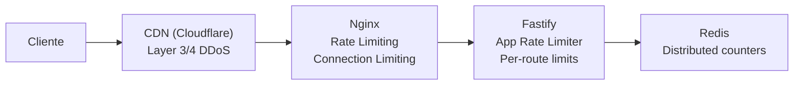

# 10 — Infraestrutura (Load Balancer, DDoS, Rate Limiting)

> **Módulo**: Core  
> **Desativável**: ❌

---

## 10.1. Load Balancing

### PM2 Cluster Mode

O backend roda em **cluster mode** via PM2, utilizando todos os cores da CPU:

```javascript
// ecosystem.config.js
module.exports = {
  apps: [{
    name: 'cenos-api',
    script: 'dist/index.js',
    instances: 'max',        // Usa todos os cores
    exec_mode: 'cluster',
    max_memory_restart: '512M',
    env: {
      NODE_ENV: 'production',
      PORT: 3000,
    },
    env_development: {
      NODE_ENV: 'development',
      instances: 2,
    },
    // Graceful shutdown
    kill_timeout: 5000,
    listen_timeout: 10000,
    // Logs
    log_date_format: 'YYYY-MM-DD HH:mm:ss Z',
    error_file: './logs/error.log',
    out_file: './logs/out.log',
    merge_logs: true,
  }],
};
```

### Nginx Reverse Proxy

```nginx
# nginx.conf
upstream cenos_api {
    least_conn;                    # Distribui para instância com menos conexões
    server 127.0.0.1:3000;
    server 127.0.0.1:3001;
    server 127.0.0.1:3002;
    server 127.0.0.1:3003;
    keepalive 64;
}

server {
    listen 80;
    server_name api.cenos.app;

    # Security headers
    add_header X-Frame-Options "SAMEORIGIN" always;
    add_header X-Content-Type-Options "nosniff" always;
    add_header X-XSS-Protection "1; mode=block" always;
    add_header Referrer-Policy "strict-origin-when-cross-origin" always;

    # DDoS Protection
    limit_req_zone $binary_remote_addr zone=api:10m rate=30r/s;
    limit_req_zone $binary_remote_addr zone=auth:10m rate=5r/s;
    limit_conn_zone $binary_remote_addr zone=addr:10m;

    # Gzip
    gzip on;
    gzip_types application/json text/plain text/css;
    gzip_min_length 1000;

    # API proxy
    location /api/ {
        limit_req zone=api burst=50 nodelay;
        limit_conn addr 100;

        proxy_pass http://cenos_api;
        proxy_http_version 1.1;
        proxy_set_header Upgrade $http_upgrade;
        proxy_set_header Connection 'upgrade';
        proxy_set_header Host $host;
        proxy_set_header X-Real-IP $remote_addr;
        proxy_set_header X-Forwarded-For $proxy_add_x_forwarded_for;
        proxy_set_header X-Forwarded-Proto $scheme;
        proxy_cache_bypass $http_upgrade;

        # Timeouts
        proxy_connect_timeout 10s;
        proxy_send_timeout 30s;
        proxy_read_timeout 30s;

        # Buffer
        proxy_buffering on;
        proxy_buffer_size 4k;
        proxy_buffers 8 4k;
    }

    # Auth endpoints — rate limiting mais agressivo
    location /api/v1/auth/ {
        limit_req zone=auth burst=10 nodelay;
        limit_conn addr 20;

        proxy_pass http://cenos_api;
        proxy_http_version 1.1;
        proxy_set_header Host $host;
        proxy_set_header X-Real-IP $remote_addr;
        proxy_set_header X-Forwarded-For $proxy_add_x_forwarded_for;
    }

    # Block common attack paths
    location ~ /\.(env|git|htaccess) {
        deny all;
        return 404;
    }

    # Frontend (SPA)
    location / {
        root /var/www/cenos/frontend/dist;
        try_files $uri $uri/ /index.html;

        # Cache static assets
        location ~* \.(js|css|png|jpg|jpeg|gif|ico|svg|woff|woff2)$ {
            expires 30d;
            add_header Cache-Control "public, immutable";
        }
    }
}
```

---

## 10.2. DDoS Protection

### Camadas de Proteção



| Camada | Proteção | Config |
|--------|----------|--------|
| **CDN/Cloudflare** | DDoS L3/L4, WAF | Gerenciado externamente |
| **Nginx** | Rate limit por IP, connection limit | `30r/s` geral, `5r/s` auth |
| **Fastify** | Rate limit por rota/usuário | Via `@fastify/rate-limit` + Redis |
| **Aplicação** | Brute force, login throttling | Custom middleware |

### Rate Limiting Application-Level

```typescript
// middleware/rate-limiter.ts
import rateLimit from '@fastify/rate-limit';

app.register(rateLimit, {
  global: true,
  max: 100,                          // 100 requests
  timeWindow: '1 minute',
  redis: redisClient,                 // Shared between cluster instances
  keyGenerator: (request) => {
    // Use user ID if authenticated, otherwise IP
    return request.user?.sub || request.ip;
  },
  errorResponseBuilder: (request, context) => ({
    success: false,
    error: {
      code: 'TOO_MANY_REQUESTS',
      message: `Rate limit excedido. Tente novamente em ${context.after}`,
      retryAfter: context.after,
    },
  }),
});
```

### Rate Limits por Rota

| Rota | Rate Limit | Window | Key |
|------|-----------|--------|-----|
| `POST /auth/login` | 5 | 15 min | IP |
| `POST /auth/forgot-password` | 3 | 1 hora | email |
| `POST /auth/refresh` | 10 | 1 min | userId |
| `GET /audit/export` | 5 | 1 hora | userId |
| Rotas gerais (autenticadas) | 100 | 1 min | userId |
| Rotas gerais (não autenticadas) | 30 | 1 min | IP |

---

## 10.3. Security Headers (Helmet)

```typescript
app.register(helmet, {
  contentSecurityPolicy: {
    directives: {
      defaultSrc: ["'self'"],
      scriptSrc: ["'self'"],
      styleSrc: ["'self'", "'unsafe-inline'", "https://fonts.googleapis.com"],
      fontSrc: ["'self'", "https://fonts.gstatic.com"],
      imgSrc: ["'self'", "data:", "https:"],
      connectSrc: ["'self'"],
    },
  },
  crossOriginEmbedderPolicy: false,
  hsts: { maxAge: 31536000, includeSubDomains: true, preload: true },
});
```

---

## 10.4. CORS

```typescript
app.register(cors, {
  origin: [env.CORS_ORIGIN],  // ex: https://cenos.app
  credentials: true,
  methods: ['GET', 'POST', 'PUT', 'DELETE', 'PATCH'],
  allowedHeaders: ['Content-Type', 'Authorization', 'X-Request-ID'],
  exposedHeaders: ['X-Request-ID', 'X-RateLimit-Remaining'],
  maxAge: 86400,
});
```

---

## 10.5. Request ID & Logging

Cada request recebe um UUID único para rastreamento:

```typescript
// middleware/request-id.ts
app.addHook('onRequest', (request, reply, done) => {
  request.id = request.headers['x-request-id'] as string || nanoid();
  request.startTime = Date.now();
  reply.header('X-Request-ID', request.id);
  done();
});
```

Logging estruturado via Pino (built-in no Fastify):
```typescript
const app = Fastify({
  logger: {
    level: env.LOG_LEVEL,
    transport: env.NODE_ENV === 'development'
      ? { target: 'pino-pretty' }
      : undefined,
    serializers: {
      req: (req) => ({
        method: req.method,
        url: req.url,
        requestId: req.id,
      }),
    },
  },
});
```

---

## 10.6. Graceful Shutdown

```typescript
async function gracefulShutdown(signal: string) {
  logger.info(`Received ${signal}. Shutting down gracefully...`);
  
  // 1. Stop accepting new connections
  await app.close();
  
  // 2. Close database connections
  await db.$client.end();
  
  // 3. Close Redis
  await redis.quit();
  
  logger.info('Shutdown complete');
  process.exit(0);
}

process.on('SIGTERM', () => gracefulShutdown('SIGTERM'));
process.on('SIGINT', () => gracefulShutdown('SIGINT'));
```

---

## 10.7. Health Check

```typescript
app.get('/health', { logLevel: 'silent' }, async () => {
  const dbOk = await checkDatabase();
  const redisOk = await checkRedis();
  
  return {
    status: dbOk && redisOk ? 'healthy' : 'degraded',
    timestamp: new Date().toISOString(),
    uptime: process.uptime(),
    services: {
      database: dbOk ? 'up' : 'down',
      redis: redisOk ? 'up' : 'down',
    },
  };
});
```

---

## 10.8. Testes — Infrastructure

```typescript
describe('Infrastructure', () => {
  describe('Health Check', () => {
    it('should return healthy when all services up');
    it('should return degraded when Redis is down');
    it('should include uptime');
  });

  describe('Rate Limiting', () => {
    it('should return 429 after exceeding global limit');
    it('should return Retry-After header');
    it('should use userId as key when authenticated');
    it('should use IP as key when unauthenticated');
    it('should share counters across cluster instances (Redis)');
  });

  describe('Security Headers', () => {
    it('should include X-Frame-Options');
    it('should include X-Content-Type-Options');
    it('should include Strict-Transport-Security');
    it('should include Content-Security-Policy');
  });

  describe('CORS', () => {
    it('should allow requests from configured origin');
    it('should block requests from unknown origin');
    it('should include credentials in response');
  });

  describe('Request ID', () => {
    it('should generate unique request ID');
    it('should pass through existing X-Request-ID header');
    it('should return X-Request-ID in response');
  });

  describe('Graceful Shutdown', () => {
    it('should close server on SIGTERM');
    it('should complete in-flight requests');
    it('should close database connections');
  });
});
```
